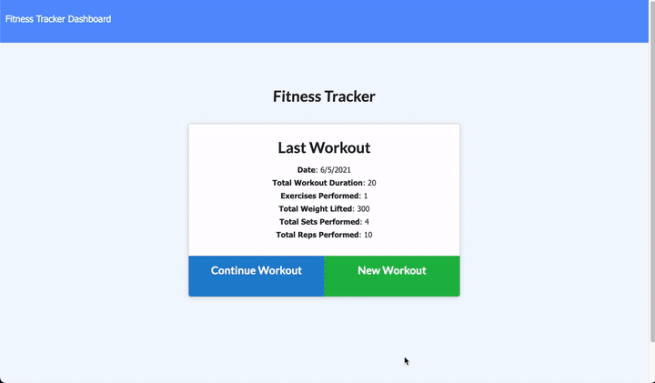

# Workout-Tracker

# Description
 Homework assignment for RCB using MongoDB and Express

# Table of Contents
  * [Development](#Development)
  * [Acceptance Criteria](Acceptance-Criteria)
  * [Installation](Installation)
  * [License](#License)
  * [Screen Recording](#Screen-Recording)
  * [Questions](#Questions)
  * [Application](#Application)

# Development

The frontend of this project was already provided in our initial setup environment.

This application is hosted and deployed on [Heroku](https://www.heroku.com). For the database server, [MongoDB Atlas](https://www.mongodb.com/cloud/atlas) is implemented.

To seed the database, we used [Mongoose](https://mongoosejs.com/) to use Javascript syntax and methods.

For server development we used [Express](https://expressjs.com/). 

# Acceptance Criteria

```
The user should be able to:

  * Add exercises to the most recent workout plan.

  * Add new exercises to a new workout plan.

  * View the combined weight of multiple exercises from the past seven workouts on the `stats` page.

  * View the total duration of each workout from the past seven workouts on the `stats` page.
```

# Installation 

Fork this project to run on your local browser.

Inside the package.json, you will see the necessary dependancies you need to install.

You will also need to make sure mongo is running. In a terminal window, make sure mongo is running by typing 

### `mongod`

The models, and routes will be set up in their respective folders. You will just need to seed the database.

To seed the database, run the script 
### `npm run seed`

After the database is seeded, run the sctipt 
### `npm run start` 

This will start the server for your browser to use.


# License

[](https://jasper-abarquez.mit-license.org)


# Screen Recording

Example of how deployed application should run:



# Application

 []((https://kuyajasper-workout-tracker.herokuapp.com/))


# Questions

Reach out at:

[](https://github.com/KuyaJasper)
[](mailto:abarquezj1@gmail.com)

[](mailto:abarquezj1@gmail.com)


